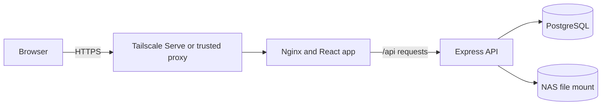
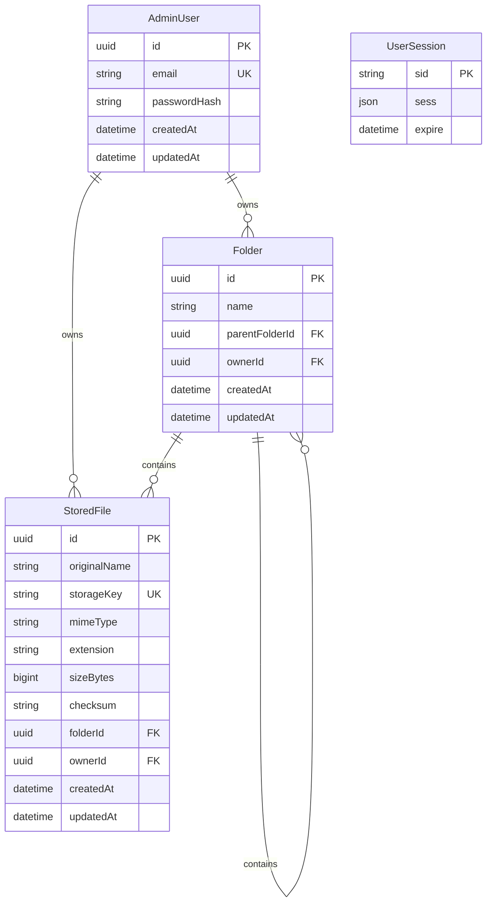
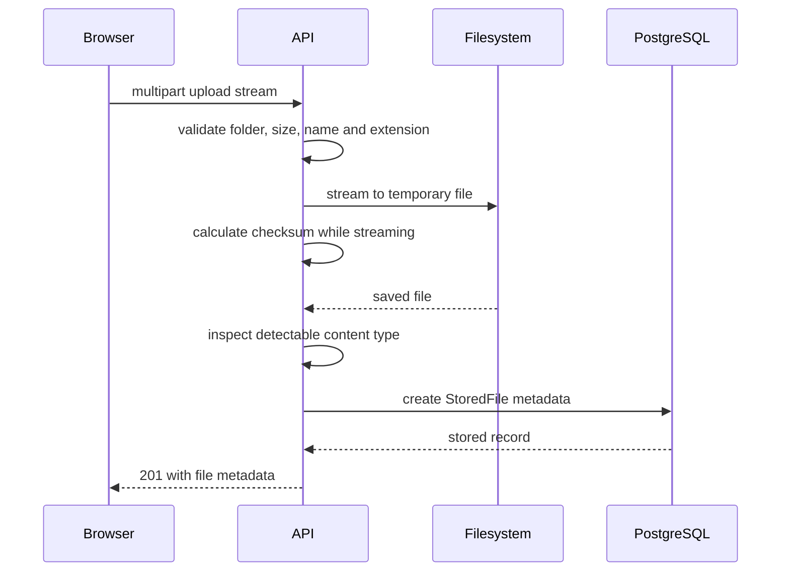

# Architecture

File Vault is a TypeScript monorepo with a React browser app, an Express API,
PostgreSQL metadata and filesystem-backed file contents. Docker Compose joins
the production services and mounts a host or NAS directory into the API.

## System overview



The web and API use the same public origin in production. Nginx serves the React
assets and proxies `/api` requests to Express over the private Compose network.
This keeps cookie and CORS handling simple and leaves the API port unpublished.

PostgreSQL stores accounts, sessions, folders and file metadata. Uploaded bytes
go to the configured filesystem mount instead of the database.

## Repository layout

```text
file_vault/
├── apps/
│   ├── api/
│   │   ├── prisma/       database schema and migrations
│   │   ├── src/          Express application code
│   │   └── tests/        API and storage tests
│   └── web/
│       ├── src/          React application code
│       └── tests/        browser workflow tests
├── docs/                 setup, deployment and design notes
├── docker-compose.yml    production services and local database
├── package.json          npm workspace scripts
└── tsconfig.base.json    shared TypeScript rules
```

The root npm workspace runs commands across both applications. Each app keeps
its own runtime dependencies, build command and tests.

## Browser application

The React app is organised by feature:

- `features/auth` owns login, logout, session queries and route guards.
- `features/files` owns file requests, uploads, lists and file actions.
- `features/folders` owns folder navigation, breadcrumbs and folder actions.
- `features/search` owns global filename search and result paging.
- `features/storage` owns the storage summary query and dashboard cards.
- `components` contains small shared states and layout pieces.
- `pages` combines features into complete routes.

React Router maps `/login`, `/dashboard` and nested folder dashboard URLs. Route
guards fetch the current session before showing a protected page. TanStack Query
owns server state and invalidates the affected file, folder or summary query
after successful changes.

The browser does not contain storage paths or database IDs that grant access by
themselves. It asks the API for every protected operation and the API checks the
session and owner.

## API application

The Express code follows a small layered structure:

```text
route -> authentication middleware -> controller -> service -> Prisma or storage
```

- Routes define HTTP methods and attach authentication.
- Controllers validate request data and turn service results into HTTP responses.
- Services hold file, folder, authentication and summary rules.
- Prisma is the metadata and session database client.
- The storage provider interface owns file byte reads and writes.
- Error middleware gives clients a consistent response for unexpected failures.

`createApp` builds the Express application from validated environment values.
`server.ts` handles database connection, first administrator creation, HTTP
startup and graceful shutdown.

## Request flow

A normal protected request follows these steps:

1. The browser sends the `filevault.sid` cookie with an `/api/v1` request.
2. Express loads that session from PostgreSQL.
3. Authentication middleware rejects the request if no user ID is present.
4. The controller checks params, query values or JSON with Zod.
5. A service runs the owner-scoped database or filesystem operation.
6. The controller returns JSON, an empty success response or a download stream.
7. TanStack Query refreshes affected dashboard data after a browser mutation.

The health route is the one deliberate public API route. Compose uses it to
decide when the API is ready before starting the web container.

## Data model



Folders use a self-relation for nesting. A null `parentFolderId` means the
folder is at the root. A file also uses a nullable folder ID, so moving it to the
root only updates metadata and does not move physical bytes.

The folder service checks for duplicate names under the same parent, refuses to
delete non-empty folders and walks parent IDs to build breadcrumbs. The walk
tracks visited IDs and has a depth limit so bad data cannot cause an endless
cycle.

Stored files keep a SHA-256 checksum and the metadata needed for display,
search, sorting and downloads. `sizeBytes` is a PostgreSQL bigint and is changed
to a JSON-safe number by API controllers.

Session rows use the table shape expected by `connect-pg-simple`. They are not
linked to `AdminUser` with a foreign key because the session library owns the
JSON payload and expiry process.

## Filesystem storage

The API depends on a `StorageProvider` interface with `save`, `open`, `delete`
and `exists` operations. `LocalFilesystemStorage` is the current implementation
and works with a normal local directory or a NAS directory mounted into the
container.

Physical files are stored under:

```text
FILEVAULT_STORAGE_PATH/files/<random UUID storage key>
```

The storage provider only accepts UUID-shaped keys. Display names never enter
this path. A write first goes to a unique temporary name and is renamed to its
final key after the stream completes. This stops an interrupted upload from
looking like a complete stored file.

## Upload flow



If content validation or metadata creation fails, the API removes the staged
file. Multiple browser uploads currently run one after another so each file can
report its part of the total progress without holding all contents in memory.

## Download and deletion flow

A download first finds a file by both file ID and session owner ID. The API then
opens the random storage key and pipes it to the response. Response headers use
the original filename and saved MIME type.

Deletion checks the same ownership rule. Metadata deletion and the storage
provider call are coordinated inside a Prisma transaction. The database can
roll back its deletion if the filesystem call fails.

A relational database transaction cannot fully roll back a filesystem change.
If the physical delete succeeds and the database commit later fails, manual
repair may be needed. Backups and operational checks are still required around
important data.

Rename and move operations only update metadata. Renaming validates the new
extension against the saved MIME type. Moving checks that the destination
folder belongs to the same owner and that the target folder does not already
contain a file with the same display name.

## Listing, search and summaries

Folder file lists are paginated and can sort by upload time, name or size.
Filename search is case-insensitive, owner-scoped and paginated across the whole
vault. Stable ID ordering is used after the selected sort field so page results
do not jump when two files have the same value.

The storage summary uses database aggregates for file count, folder count,
latest upload time and total bytes. It reports metadata totals rather than
scanning the filesystem on every dashboard load.
